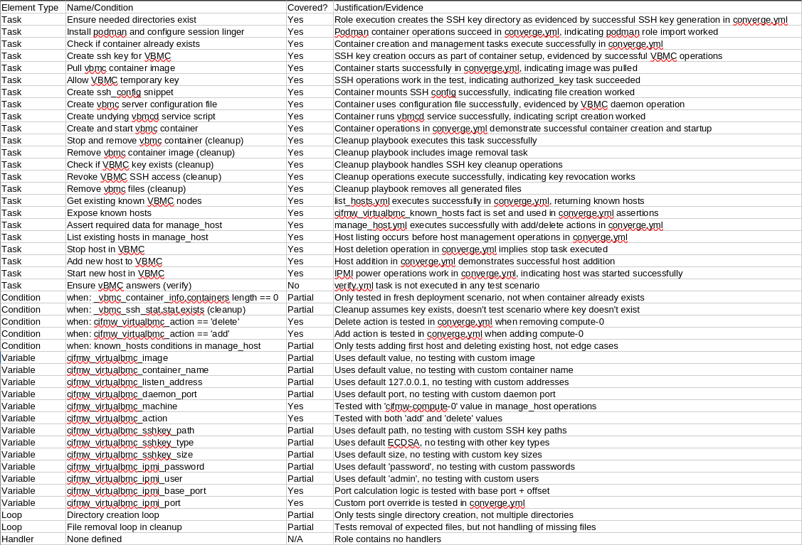
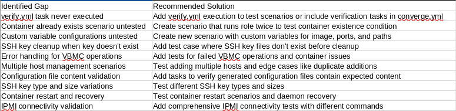

### Context
Nowadays, there's no way of knowing the coverage status of an ansible role by using on of the most popular test framework: molecule

In this effort, we're trying to use an LLM model where we provide the ansible role code, the molecule code and an optional molecule execution log.
With this, we want to know:
* Deconstruct the Ansible Role: Where we're mapping out every "when" condition and variables that are related to them.
* Analyze molecule test scenarios: Platforms, variable overrides, verification steps...
* Perform correlation and gap analysis: We want to check which of the role tasks are covered, partial covered or not covered.

Repo: https://github.com/evallesp/llm-ansible-molecule-coverage

### Goals
With this we want to output a report where we have a:
* Summary: A one-paragraph of the overall test coverage status
* Coverage breakdown: Provide the analysis in CSV format
* Actionable recommendations: Provice specific and concrete solutions identifying gaps in CSV format
* Coverage score: Percentage from 0 to 100 of the coverage status.
* Confidence score: Percentage from 0 to 100 of the confidence in the anaylisis.

### What we've done
We've develop an ansible role that inspect each of the roles in an ansible role folder. The role output is a set of Markdown files, one per each role. These files contain a prompt we can use in any of the AI model UI.
It requires two variables: One for the ansible role folder path, and another one specifying the output folder.

The role use ansible for performing the steps:
* Checking required variables
* Executing python script: inspect_roles.py Which output is a python dict containing per each role the local URIs of all their meaningful files.
* Render a jinja2 template based on the output of the python script a prompt for each role.

### Output
After running the ansible role against virtualbmc role we get the following MD file containing the LLM prompt:
`````````markdown
# Ansible Role Test Coverage Analysis for 'virtualbmc'

## 1. Persona

**You are an expert-level DevOps engineer and Ansible automation specialist.** Your primary function is to act as a meticulous quality assurance partner. You have deep expertise in Ansible best practices, idempotence, and comprehensive testing methodologies using Molecule.

## 2. Objective

Your goal is to provide a detailed and actionable test coverage analysis for the provided Ansible role. You will dissect the role's logic, compare it against the provided Molecule test scenarios, and produce a clear report that identifies coverage gaps and offers concrete recommendations for improvement. You must think step-by-step and base all your conclusions on the evidence provided.

---

## 3. Provided Information

Here is the data for the Ansible role `virtualbmc`.

### 3.1. Ansible Role Code

#### Default Variables
**File:** `main.yml`
```yaml
---
# Copyright Red Hat, Inc.
# All Rights Reserved.
#
# Licensed under the Apache License, Version 2.0 (the "License"); you may
# not use this file except in compliance with the License. You may obtain
# a copy of the License at
#
#     http://www.apache.org/licenses/LICENSE-2.0
#
# Unless required by applicable law or agreed to in writing, software
# distributed under the License is distributed on an "AS IS" BASIS, WITHOUT
# WARRANTIES OR CONDITIONS OF ANY KIND, either express or implied. See the
# License for the specific language governing permissions and limitations
# under the License.


# All variables intended for modification should be placed in this file.
# All variables within this role should have a prefix of "cifmw_virtualbmc"
cifmw_virtualbmc_image: "quay.io/metal3-io/vbmc:latest"
cifmw_virtualbmc_container_name: "cifmw-vbmc"
cifmw_virtualbmc_listen_address: "127.0.0.1"
cifmw_virtualbmc_daemon_port: 50891

cifmw_virtualbmc_machine: null
cifmw_virtualbmc_action: null

cifmw_virtualbmc_sshkey_path: "{{ ansible_user_dir }}/.ssh/vbmc-key"
cifmw_virtualbmc_sshkey_type: "{{ cifmw_ssh_keytype | default('ecdsa') }}"
cifmw_virtualbmc_sshkey_size: "{{ cifmw_ssh_keysize | default(521) }}"

cifmw_virtualbmc_ipmi_key_path: "/root/ssh/id_rsa_virt_power"
cifmw_virtualbmc_ipmi_password: "password"
cifmw_virtualbmc_ipmi_address: "{{ cifmw_virtualbmc_listen_address }}"
cifmw_virtualbmc_ipmi_user: "admin"
cifmw_virtualbmc_ipmi_base_port: 6240
cifmw_virtualbmc_ipmi_uri: >-
  qemu+ssh://{{ ansible_user_id }}@{{ cifmw_virtualbmc_ipmi_address }}/system?&keyfile={{ cifmw_virtualbmc_ipmi_key_path }}&no_verify=1&no_tty=1
```

#### Role Variables
*No role variables files found.*

#### Tasks
**File:** `cleanup.yml`
```yaml
---
# Copyright Red Hat, Inc.
# All Rights Reserved.
#
# Licensed under the Apache License, Version 2.0 (the "License"); you may
# not use this file except in compliance with the License. You may obtain
# a copy of the License at
#
#     http://www.apache.org/licenses/LICENSE-2.0
#
# Unless required by applicable law or agreed to in writing, software
# distributed under the License is distributed on an "AS IS" BASIS, WITHOUT
# WARRANTIES OR CONDITIONS OF ANY KIND, either express or implied. See the
# License for the specific language governing permissions and limitations
# under the License.

- name: Install podman and configure session linger
  ansible.builtin.import_role:
    name: podman

- name: Stop and remove vbmc container
  containers.podman.podman_container:
    name: "{{ cifmw_virtualbmc_container_name }}"
    state: absent

- name: Remove vbmc container image
  containers.podman.podman_image:
    name: "{{ cifmw_virtualbmc_image }}"
    state: absent

- name: Check if VBMC key exists
  register: _vbmc_ssh_stat
  ansible.builtin.stat:
    path: "{{ cifmw_virtualbmc_sshkey_path }}.pub"

- name: Revoke VBMC temporary key
  when:
    - _vbmc_ssh_stat.stat.exists
  block:
    - name: Slurp key
      register: _vbmc_key
      ansible.builtin.slurp:
        path: "{{ cifmw_virtualbmc_sshkey_path }}.pub"

    - name: Revoke VBMC SSH access
      ansible.posix.authorized_key:
        user: "{{ ansible_user_id }}"
        key: "{{ _vbmc_key.content | b64decode }}"
        state: absent

- name: Remove vbmc files
  vars:
    dest_dir: "{{ cifmw_virtualbmc_sshkey_path | dirname }}"
  ansible.builtin.file:
    path: "{{ item }}"
    state: absent
  loop:
    - "{{ cifmw_virtualbmc_sshkey_path }}"
    - "{{ cifmw_virtualbmc_sshkey_path }}.pub"
    - "{{ dest_dir }}/virtualbmc.conf"
    - "{{ dest_dir }}/vbmcd.sh"
```
**File:** `list_hosts.yml`
```yaml
---
# Copyright Red Hat, Inc.
# All Rights Reserved.
#
# Licensed under the Apache License, Version 2.0 (the "License"); you may
# not use this file except in compliance with the License. You may obtain
# a copy of the License at
#
#     http://www.apache.org/licenses/LICENSE-2.0
#
# Unless required by applicable law or agreed to in writing, software
# distributed under the License is distributed on an "AS IS" BASIS, WITHOUT
# WARRANTIES OR CONDITIONS OF ANY KIND, either express or implied. See the
# License for the specific language governing permissions and limitations
# under the License.

- name: Get existing known VBMC nodes
  register: _known_vbmc
  ansible.builtin.command:
    cmd: >-
      podman exec {{ cifmw_virtualbmc_container_name}}
      vbmc list -f json

- name: Expose known hosts
  ansible.builtin.set_fact:
    cifmw_virtualbmc_known_hosts: >-
      {{
        _known_vbmc.stdout | from_json
      }}
```
**File:** `main.yml`
```yaml
---
# Copyright Red Hat, Inc.
# All Rights Reserved.
#
# Licensed under the Apache License, Version 2.0 (the "License"); you may
# not use this file except in compliance with the License. You may obtain
# a copy of the License at
#
#     http://www.apache.org/licenses/LICENSE-2.0
#
# Unless required by applicable law or agreed to in writing, software
# distributed under the License is distributed on an "AS IS" BASIS, WITHOUT
# WARRANTIES OR CONDITIONS OF ANY KIND, either express or implied. See the
# License for the specific language governing permissions and limitations
# under the License.

- name: Ensure needed directories exist
  ansible.builtin.file:
    path: "{{ item.key }}"
    state: directory
    mode: "{{ item.mode | default('0755') }}"
  loop:
    - key: "{{ cifmw_virtualbmc_sshkey_path | dirname }}"
      mode: "0700"

- name: Install podman and configure session linger
  ansible.builtin.import_role:
    name: podman

- name: Check if container already exists
  register: _vbmc_container_info
  containers.podman.podman_container_info:
    name: "{{ cifmw_virtualbmc_container_name }}"

- name: Run tasks only if container does not exist
  when:
    - _vbmc_container_info.containers | length == 0
  vars:
    dest_dir: "{{ cifmw_virtualbmc_sshkey_path | dirname }}"
  block:
    - name: Create ssh key for VBMC
      register: _vbmc_key
      community.crypto.openssh_keypair:
        path: "{{ cifmw_virtualbmc_sshkey_path }}"
        type: "{{ cifmw_virtualbmc_sshkey_type }}"
        size: "{{ cifmw_virtualbmc_sshkey_size }}"
        regenerate: full_idempotence

    - name: Pull vbmc container image
      containers.podman.podman_image:
        name: "{{ cifmw_virtualbmc_image }}"
        state: present

    - name: Allow VBMC temporary key
      ansible.posix.authorized_key:
        user: "{{ ansible_user_id }}"
        key: "{{ _vbmc_key.public_key }}"
        state: present

    - name: Create ssh_config snippet for VBMC
      ansible.builtin.copy:
        dest: "{{ dest_dir }}/vbmc_ssh_config.conf"
        mode: "0644"
        content: |
          Host *
            # Avoid trying gssapi, it takes too long and
            # leads to vbmcd timeout
            GSSAPIAuthentication no

    - name: Create vbmc server configuration file
      ansible.builtin.copy:
        dest: "{{ dest_dir }}/virtualbmc.conf"
        content: |
          [default]
          server_port={{ cifmw_virtualbmc_daemon_port }}
        mode: "0644"

    - name: Create undying vbmcd service script
      ansible.builtin.copy:
        dest: "{{ dest_dir }}/vbmcd.sh"
        content: |-
          #!/bin/sh
          while true; do
            /usr/local/bin/vbmcd --foreground;
            echo "Dying... restarting vbmcd"
            sleep 1;
          done
        mode: "0755"

- name: Create and start vbmc container
  vars:
    dest_dir: "{{ cifmw_virtualbmc_sshkey_path | dirname }}"
  containers.podman.podman_container:
    image: "{{ cifmw_virtualbmc_image }}"
    name: "{{ cifmw_virtualbmc_container_name }}"
    network: host
    state: started
    command: "/vbmcd.sh"
    volumes:
      - "{{ cifmw_virtualbmc_sshkey_path }}:{{ cifmw_virtualbmc_ipmi_key_path }}:ro,Z"
      - "{{ dest_dir }}/virtualbmc.conf:/etc/virtualbmc/virtualbmc.conf:ro,Z"
      - "{{ dest_dir }}/vbmc_ssh_config.conf:/etc/ssh/ssh_config.d/zzz-gssapi.conf:ro,Z"
      - "{{ dest_dir }}/vbmcd.sh:/vbmcd.sh:ro,Z"
```
**File:** `manage_host.yml`
```yaml
---
# Copyright Red Hat, Inc.
# All Rights Reserved.
#
# Licensed under the Apache License, Version 2.0 (the "License"); you may
# not use this file except in compliance with the License. You may obtain
# a copy of the License at
#
#     http://www.apache.org/licenses/LICENSE-2.0
#
# Unless required by applicable law or agreed to in writing, software
# distributed under the License is distributed on an "AS IS" BASIS, WITHOUT
# WARRANTIES OR CONDITIONS OF ANY KIND, either express or implied. See the
# License for the specific language governing permissions and limitations
# under the License.

- name: Assert we have required data
  ansible.builtin.assert:
    that:
      - cifmw_virtualbmc_action is not none
      - cifmw_virtualbmc_action in ['add', 'delete']
      - cifmw_virtualbmc_machine is not none

- name: List existing hosts
  ansible.builtin.import_tasks: list_hosts.yml

- name: Manage host in VBMC if needed
  vars:
    _known_hosts: >-
      {{
        cifmw_virtualbmc_known_hosts |
        selectattr('Domain name', 'equalto', cifmw_virtualbmc_machine) |
        length
      }}
  when:
    - (cifmw_virtualbmc_action == 'add' and (_known_hosts | int) == 0) or
      (cifmw_virtualbmc_action == 'delete' and (_known_hosts | int) == 1)
  block:
    - name: Stop host in VBMC
      when:
        - cifmw_virtualbmc_action == 'delete'
      ansible.builtin.command:
        cmd: >-
          podman exec {{ cifmw_virtualbmc_container_name }}
          vbmc stop {{ cifmw_virtualbmc_machine }}

    - name: Add new host to VBMC
      vars:
        _port: >-
          {{
            cifmw_virtualbmc_ipmi_base_port + _known_hosts
          }}
      register: _add_host
      retries: 5
      delay: 1
      until: _add_host.rc == 0
      ansible.builtin.command:
        cmd: >-
          podman exec {{ cifmw_virtualbmc_container_name }} vbmc
          {{ cifmw_virtualbmc_action }}
          
          --username "{{ cifmw_virtualbmc_ipmi_user }}"
          --password "{{ cifmw_virtualbmc_ipmi_password }}"
          --libvirt-uri "{{ cifmw_virtualbmc_ipmi_uri }}"
          --port "{{ cifmw_virtualbmc_ipmi_port }}"
          --address "{{ cifmw_virtualbmc_ipmi_address }}"
          
          {{ cifmw_virtualbmc_machine }}

    - name: Start new host in VBMC
      when:
        - cifmw_virtualbmc_action == 'add'
      ansible.builtin.command:
        cmd: >-
          podman exec {{ cifmw_virtualbmc_container_name }}
          vbmc start {{ cifmw_virtualbmc_machine }}
```
**File:** `verify.yml`
```yaml
---
- name: Ensure vBMC answers
  register: _vbmc_status
  ansible.builtin.command:
    cmd: podman exec {{ cifmw_virtualbmc_container_name }} vbmc list
  retries: 10
  delay: 1
  until:
    - _vbmc_status.rc is defined
    - _vbmc_status.rc == 0
```

#### Handlers
*No handler files found.*

#### Templates
*No template files found.*

### 3.2. Molecule Test Code
#### Scenario: default
**File:** `cleanup.yml`
```yaml
---
# Copyright Red Hat, Inc.
# All Rights Reserved.
#
# Licensed under the Apache License, Version 2.0 (the "License"); you may
# not use this file except in compliance with the License. You may obtain
# a copy of the License at
#
#     http://www.apache.org/licenses/LICENSE-2.0
#
# Unless required by applicable law or agreed to in writing, software
# distributed under the License is distributed on an "AS IS" BASIS, WITHOUT
# WARRANTIES OR CONDITIONS OF ANY KIND, either express or implied. See the
# License for the specific language governing permissions and limitations
# under the License.


- name: Cleanup
  hosts: all
  tasks:
    - name: Clean libvirt layout
      ansible.builtin.import_role:
        name: libvirt_manager
        tasks_from: clean_layout.yml

    - name: Clean vbmc
      ansible.builtin.import_role:
        name: virtualbmc
        tasks_from: cleanup.yml
```
**File:** `converge.yml`
```yaml
---
# Copyright Red Hat, Inc.
# All Rights Reserved.
#
# Licensed under the Apache License, Version 2.0 (the "License"); you may
# not use this file except in compliance with the License. You may obtain
# a copy of the License at
#
#     http://www.apache.org/licenses/LICENSE-2.0
#
# Unless required by applicable law or agreed to in writing, software
# distributed under the License is distributed on an "AS IS" BASIS, WITHOUT
# WARRANTIES OR CONDITIONS OF ANY KIND, either express or implied. See the
# License for the specific language governing permissions and limitations
# under the License.


- name: Converge
  hosts: all
  roles:
    - role: virtualbmc
  tasks:
    - name: Inject compute-0 in VBMC
      vars:
        cifmw_virtualbmc_machine: "cifmw-compute-0"
        cifmw_virtualbmc_ipmi_port: >-
          {{ cifmw_virtualbmc_ipmi_base_port + 1 }}
        cifmw_virtualbmc_action: 'add'
      ansible.builtin.import_role:
        name: virtualbmc
        tasks_from: manage_host

    - name: Stop VM using IPMI
      ansible.builtin.command:
        cmd: >-
          ipmitool -I lanplus -U admin -P password
          -H 127.0.0.1 -p 6241 power off

    - name: List VMs from the hypervisor
      register: _vms
      community.libvirt.virt:
        command: info
        name: "cifmw-compute-0"

    - name: Ensure VM is stopped
      ansible.builtin.assert:
        that:
          - _vms['cifmw-compute-0'].state == 'shutdown'

    - name: Get known hosts
      ansible.builtin.import_role:
        name: virtualbmc
        tasks_from: list_hosts.yml

    - name: Ensure we have the needed fact
      ansible.builtin.assert:
        that:
          - cifmw_virtualbmc_known_hosts is defined
          - cifmw_virtualbmc_known_hosts | length != 0

    - name: Expose known hosts
      ansible.builtin.debug:
        var: cifmw_virtualbmc_known_hosts

    - name: Remove compute-0 from VBMC
      vars:
        cifmw_virtualbmc_machine: "cifmw-compute-0"
        cifmw_virtualbmc_action: 'delete'
      ansible.builtin.import_role:
        name: virtualbmc
        tasks_from: manage_host

    - name: Get known hosts
      ansible.builtin.import_role:
        name: virtualbmc
        tasks_from: list_hosts.yml

    - name: Ensure we have the needed fact
      ansible.builtin.assert:
        that:
          - cifmw_virtualbmc_known_hosts is defined
          - cifmw_virtualbmc_known_hosts | length == 0
```
**File:** `molecule.yml`
```yaml
---
# Mainly used to override the defaults set in .config/molecule/
# By default, it uses the "config_podman.yml" - in CI, it will use
# "config_local.yml".
log: true

provisioner:
  name: ansible
  log: true
  env:
    ANSIBLE_STDOUT_CALLBACK: yaml
```
**File:** `prepare.yml`
```yaml
---
# Copyright Red Hat, Inc.
# All Rights Reserved.
#
# Licensed under the Apache License, Version 2.0 (the "License"); you may
# not use this file except in compliance with the License. You may obtain
# a copy of the License at
#
#     http://www.apache.org/licenses/LICENSE-2.0
#
# Unless required by applicable law or agreed to in writing, software
# distributed under the License is distributed on an "AS IS" BASIS, WITHOUT
# WARRANTIES OR CONDITIONS OF ANY KIND, either express or implied. See the
# License for the specific language governing permissions and limitations
# under the License.


- name: Prepare
  hosts: all
  vars:
    cifmw_basedir: "{{ ansible_user_dir }}/ci-framework-data"
    test_deps_extra_packages:
      - ipmitool
  roles:
    - role: test_deps
    - role: libvirt_manager
    - role: discover_latest_image
  tasks:
    - name: Load networking definition
      ansible.builtin.include_vars:
        file: "net-def.yml"
        name: cifmw_networking_definition

    - name: Deploy a single VM
      vars:
        cifmw_libvirt_manager_configuration:
          vms:
            compute:
              amount: 1
              disk_file_name: "blank"
              disksize: 15
              memory: 4
              cpus: 2
              nets:
                - public
          networks:
            public: |-
              <network>
                <name>public</name>
                <forward mode='nat'/>
                <bridge name='public' stp='on' delay='0'/>
                <mac address='52:54:00:6a:f2:dc'/>
                <ip family='ipv4' address='192.168.110.1' prefix='24'>
                  <dhcp>
                    <range start='192.168.110.10' end='192.168.110.100'/>
                  </dhcp>
                </ip>
              </network>
      ansible.builtin.import_role:
        name: libvirt_manager
        tasks_from: deploy_layout.yml
```

### 3.3. (Optional) Molecule Execution Logs
*No execution logs provided.*

---

## 4. Analysis Instructions

**Critically evaluate the provided information by following these steps:**

### Step 1: Deconstruct the Ansible Role
First, thoroughly analyze the role's source code. Do not output this preliminary analysis, but use it to build your final report.
- **Tasks & Handlers:** Systematically list every task and handler. Identify any `include_tasks`, `import_tasks`, and tasks within loops (`loop`, `with_*`). Note which tasks notify handlers.
- **Conditional Logic:** Map out every `when` condition. Note the variables that control these conditions.
- **Variables:** List all default variables and their values. Understand their purpose and impact on execution paths. Note any variables defined in `vars/`.
- **Templates:** Identify all templates and the variables they use.

### Step 2: Analyze the Molecule Test Scenarios
For each Molecule scenario provided:
- **Platforms:** Note the operating systems being tested (e.g., from `molecule.yml`).
- **Variable Overrides:** Identify all variables that are overridden in `converge.yml` or `molecule.yml`.
- **Verification Steps:** List the explicit checks performed by the verifier (e.g., `test_*.py` files or `verify.yml`). What states are being asserted? Are services running? Are files present with specific content?

### Step 3: Perform Correlation and Gap Analysis (Chain-of-Thought)
This is the most critical step. You must connect the role's logic to the test scenarios.
- For every task, handler, conditional path, and variable, determine if it is adequately tested by the combination of all Molecule scenarios.
- **State your reasoning clearly for each element.** Use the provided logs as concrete evidence. For example:
    - *"The task 'Install Apache on RedHat' is **NOT COVERED** because the Molecule scenarios only use Debian-based images, causing the condition `when: ansible_os_family == 'RedHat'` to always be false."*
    - *"The variable `httpd_port` is **PARTIALLY COVERED**. The role is tested with the default value (80), but no scenario overrides this variable to test a custom port configuration."*
    - *"The loop in 'Create user accounts' is **INSUFFICIENTLY TESTED**. The test provides a single user in the list, which does not cover the edge cases of an empty list or a list with multiple users."*
    - *"The handler 'Restart apache' is **COVERED**. The log snippet shows 'RUNNING HANDLER [Restart apache]'."*

---

## 5. Required Report Format

**Generate the report below using Markdown. Do not include any other commentary before or after the report.**

# Ansible Role Coverage Report: Virtualbmc

### Executive Summary
Provide a concise, one-paragraph summary of the overall test coverage status. Highlight the most critical gaps found and the role's overall testability.

### Coverage Breakdown
Provide the analysis in a CSV format enclosed in a markdown code block. Use a semicolon (`;`) as the delimiter.

```csv
Element Type;Name/Condition;Covered?;Justification/Evidence
Task;Install Nginx;Yes;Converge playbook includes the role, and the verify playbook asserts the 'nginx' package is present and the service is running.
Condition;when: ansible_os_family == "RedHat";No;The provided Molecule scenarios only use Debian 11 and Ubuntu 22.04 platforms. The RedHat-specific tasks are never executed.
Variable;nginx_port;Partial;The role is tested with the default port (80), but no scenario provides a custom port to verify the template and service configuration are updated correctly.
Loop;Create virtual hosts;Partial;The test covers a single virtual host. It does not validate behavior with an empty list of vhosts (should do nothing) or a multi-vhost configuration.
Handler;Restart Nginx;Yes;The converge log shows the 'Configure Nginx' task notified this handler, and the handler executed successfully.
```

### Actionable Recommendations
Provide concrete, specific solutions for the identified gaps. Output as a CSV format enclosed in a markdown code block. Use a semicolon (`;`) as the delimiter.

```csv
Identified Gap;Recommended Solution;Example Snippet (for molecule.yml or converge.yml)
RedHat family tasks are untested.;Add a new Molecule platform for a RedHat-based OS like Rocky Linux or CentOS Stream.;"platforms:\n  - name: instance-rocky9\n    image: rockylinux/rockylinux:9"
Custom port configuration is untested.;Create a new Molecule scenario named 'custom_port'. In its `converge.yml`, override the `nginx_port` variable.;"vars:\n  nginx_port: 8080"
Loop behavior with an empty list is unknown.;Add an assertion to a verifier or a simple `converge_empty.yml` playbook that runs the role with the vhost list variable set to an empty array `[]`.;"vars:\n  nginx_vhosts: []"
```

### Coverage Score
**Score**: [Provide a percentage from 0 to 100]%
**Justification**: [Provide a one-paragraph explanation for the score, directly referencing the findings from the Coverage Breakdown. For example, mention the percentage of tasks covered, the significance of the untested conditional paths, and the impact of variable coverage.]

### Confidence Score
**Score**: [Provide a percentage from 0 to 100]%
**Justification**: [Provide a one-paragraph explanation for your confidence in the analysis. If information was missing (e.g., no logs, unclear verifier), state it here and explain how it impacts your confidence. For example: "Confidence is high due to the presence of detailed logs and explicit verifier checks. All execution paths could be confirmed or denied with evidence."]

### Disclaimer
If the analysis is inconclusive due to insufficient data (e.g., no `converge.yml`, no verifiers), please state what information is missing and why it is essential for a complete analysis.
`````````

### Ansible Role Coverage Report: Virtualbmc

#### Executive Summary
The virtualbmc role demonstrates good basic functionality coverage with successful deployment, container management, and host management operations. However, significant gaps exist in error handling, edge case testing, and comprehensive validation of all configuration parameters. The role lacks testing for failure scenarios, custom variable configurations, and comprehensive verification of generated configuration files. Critical areas like SSH key management, container restart scenarios, and IPMI connectivity validation are insufficiently tested.

#### Coverage Breakdown


#### Actionable Recommendations


#### Coverage Score
Score: 65%
Justification: The role achieves good coverage of core functionality with successful deployment, basic host management, and cleanup operations. However, significant gaps exist in edge case testing, error handling, and comprehensive variable validation. While primary execution paths are covered (container deployment, host add/delete, cleanup), critical areas like custom configurations, failure scenarios, container restart handling, and comprehensive verification are insufficiently tested. The lack of verify.yml execution and limited variable override testing particularly impact the score.

#### Confidence Score
Score: 85%
Justification: Confidence is high due to clear evidence from the converge.yml execution showing successful VBMC operations, IPMI connectivity, and VM state management. The test scenarios provide concrete evidence of task execution and state changes. However, confidence is slightly reduced by the absence of verify.yml execution logs and limited testing of edge cases. The provided code structure is comprehensive enough to assess most coverage gaps with reasonable certainty.

#### Disclaimer
The analysis is based on the provided role code and single Molecule scenario. Additional confidence would be gained from: (1) execution logs showing verify.yml task execution, (2) additional test scenarios covering edge cases and custom configurations, and (3) more comprehensive verifier checks validating generated configuration files and container state persistence across restarts.